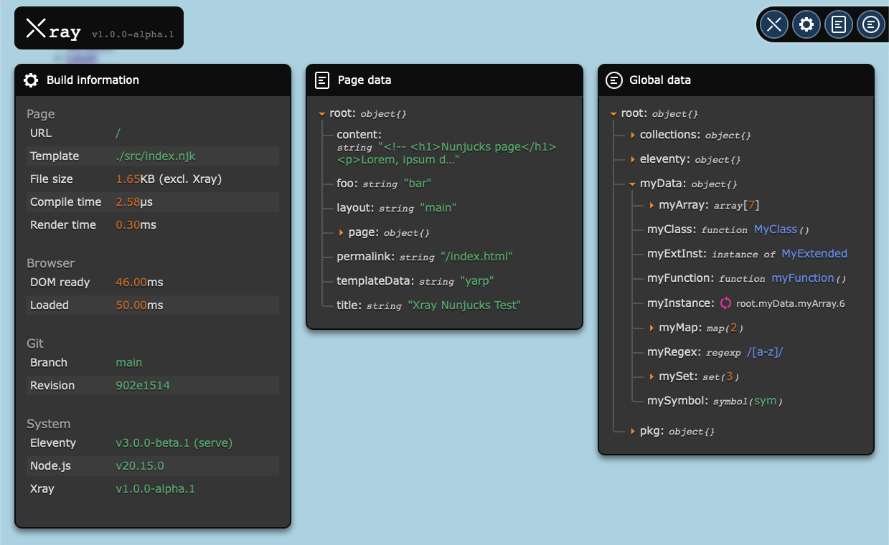

# Xray plugin for Eleventy
Xray is a plugin for [Eleventy](https://www.11ty.dev/) which visualizes the complete data hierarchy and build information of every rendered page directly in the browser.

With Xray you can, for example, quickly debug your pagination. Or confirm that your generated data is correct. Or simply discover what data is available where. No need for `<pre>{{ myData | dump }}</pre>` or `console.log()`.

> ⚠️ This is an alpha release! This means that bugs are expected and things might not run as expected. Everything is still being worked on. If you encounter any bugs, please create an issue.

## Table of Contents
- [Prerequisites](#prerequisites)
- [ES module](#es-module)
- [Installation](#installation)
  - [eleventy.config.json](#eleventyconfigjson)
    - [Plugin options](#plugin-options)
  - [Shortcode](#shortcode)
- [Displayed information](#displayed-information)
  - [Build information](#build-information)
  - [Page data](#page-data)
  - [Global data](#global-data)
- [Modes of operation](#modes-of-operation)
  - [serve](#serve)
  - [build](#build)
  - [auto](#auto) 
- [Performance](#performance)
- [License](#license)

## Prerequisites
Xray requires Node.js >= 18.20 and Eleventy >= v3.0.0-beta.1 to run.

## ES module
Xray has been written as an ECMAScript module and all examples will use ES module syntax. If you want to use Xray within a CommonJS application, use dynamic [`import()`](https://developer.mozilla.org/en-US/docs/Web/JavaScript/Reference/Operators/import) instead of `require()`.

## Installation
Firstly, add Xray to your Eleventy project.

```shell
npm i eleventy-plugin-xray@canary
```

### eleventy.config.json
Then, add the plugin in `eleventy.config.json`:

```javascript
import XRayPlugin from 'eleventy-plugin-xray';

export default (eleventyConfig) => {
  eleventyConfig.addPlugin(XRayPlugin);
}
```

#### Plugin options
You can also add options to the plugin:

```javascript
eleventyConfig.addPlugin(XRayPlugin, {
  dir: '_xray'
});
```

List of available options:

|Name | Description | Type of value | Default |
| -- | -- | -- | -- |
| `mode` | The mode in which Xray will operate ('serve', 'build', 'auto'). See [modes of operation](#modes-of-operation).  | `String` | 'auto' |
| `dir` | The directory in which Xray writes its assets and data files. Relative to `eleventyConfig.dir.output`. | `String` | '_xray' |
| `benchmarks` | Should benchmark data be parsed and displayed? | `Boolean` | `true` | 
| `git` | Should Git info of `eleventyConfig.dir.input` be displayed? | `Boolean` | `true` |
| `cutoff` | Text content is cut off after this character length. | `Number` | 45 |
| `maxDepth` | How many levels of depth should the parser traverse? | `Number` | 8 |
| `logLevel` | The log level of the in-browser console. | `String` ('debug', 'info', 'warn', 'error' or 'none') | 'info' | 
| `onlyEnvName` | The name of the environment variable to match `onlyEnv` against. | `String` | 'ELEVENTY_ENV' |
| `onlyEnv` | Only render Xray when the environment variable `onlyEnvName` equals `onlyEnv`'s value. | `String` | `undefined` |

### Shortcode
Lastly, add the shortcode `` to every page where you want Xray to be displayed. Preferably right before the closing `</body>` tag. If you want it on every page, you can add it to a layout file (please see [Performance](#performance) before doing this). 

Xray currently works with Liquid and Nunjucks templates. Markdown and other template languages will work as well when they are preprocessed by the Nunjucks or Liquid engine.

## Displayed information
On every page rendered with the `` shortcode, you'll see the Xray 'X' in the upper right corner. If you click on it, the Xray user interface will appear in front of your web page. Xray currently consists of three windows: Build information, page data and global data. All three windows can be toggled on and off by clicking on the respective icon in the ”Xray tray” in the upper right corner, where you also can hide Xray again.



### Build information
This window shows Eleventy benchmark data of the current page and Browser load times. It (optionally) also shows basic Git information of the `eleventyConfig.dir.input` directory.

*Note*: Please take all benchmark times with a grain of salt since they include the rendering of Xray itself.

### Page data
The front matter data available on the current page. Currently, template and directory data will also be displayed here. (I'm currently looking into ways to better show where these data sets are coming from.)

You can click on every branch to open it and see the underlying data and branches. Alt-click opens and closes all underlying branches.

### Global data
The available global data. For the sake of clarity, this is displayed separately from the page data. Global data includes data from your global data files, Eleventy supplied data and your collections. The latter is a special case: Collections will be listed but not (yet?) traversed.

You can navigate the branches here as well.

## Modes of operation
Through the option `mode`, three modes of operation can be configured: `serve`, `build` and `auto`.

### serve
If Eleventy runs in `serve` mode as well, all Xray files will be served virtually through the [Eleventy Dev Server](https://www.11ty.dev/docs/dev-server/). No files will be written to disk. Virtual files will have precedence over static files e.g. from a previous run in `build` mode.  
If Eleventy runs in another mode, Xray is deactivated.

### build
All Xray files will be written to disk and served as static files. Xray uses relative paths to load these static files, so Xray even works when opening a rendered HTML page in the browser without the Eleventy Dev Server.

### auto
Synchronizes Xray's mode with Eleventy's run mode.

## Performance
Since Xray recursively parses the complete data hierarchy of _every_ page it has been added to, it can _significantly_ extend Eleventy's build times. If you build a website with hundreds of pages and/or hundreds of data sets, consider reducing `maxDepth` to a minimum and adding the shortcode only to the page(s) you are currently working on.

## License
eleventy-plugin-xray is © 2024 Walter Krivanek and released under the [MIT license](https://mit-license.org).
